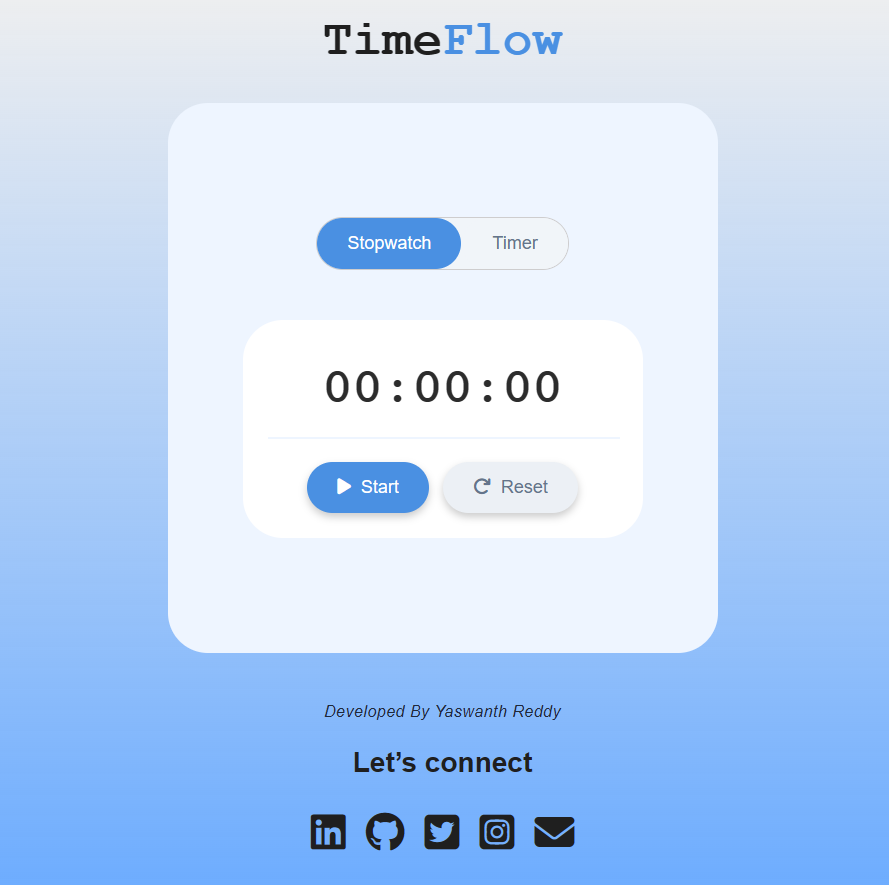

# ⏱️ TimeFlow - Stopwatch & Timer Web App

TimeFlow is a modern and clean **Stopwatch & Timer web application** built using **HTML, CSS, and JavaScript**.  
It provides smooth functionality, responsive design, and an elegant user interface for tracking time efficiently.

---

## 🌐 Live Demo

🔗 https://timeflow.ccbp.tech/

---

## ✨ Features

- ⏱️ Stopwatch with Start, Pause, Resume, and Reset  
- ⏳ Countdown Timer with custom input (HH : MM : SS)  
- 🔄 Resume functionality without restarting  
- 🎯 Smooth and responsive UI interactions  
- 💎 Clean and minimal design  
- 🎨 CSS animations (hover effects, transitions, pulse effect)  
- 🔘 Toggle between Stopwatch and Timer modes  

---

## 🛠️ Tech Stack

- HTML5  
- CSS3 (Flexbox, Gradients, Animations)  
- JavaScript (DOM Manipulation, Timers, Event Handling)  

---

## 📸 Screenshot

---

## 📂 Project Structure
TimeFlow/
│── index.html
│── style.css
│── script.js
│── screenshot.png
│── README.md

---

## ⚙️ How to Run Locally

1. Clone the repository:
git clone https://github.com/yaswanthr233/timeflow-yaswanth.git

2. Open the project folder  

3. Run `index.html` in your browser  

---

## 🌟 Key Highlights

- Beginner-friendly project with real-world UI  
- Strong understanding of JavaScript timers  
- Clean and structured code  
- Portfolio-ready mini project  

---

## 🚀 Future Improvements

- 🔊 Add alarm sound when timer ends  
- 🌙 Dark mode toggle  
- 📊 Timer history and analytics  
- 📱 Improved mobile responsiveness  
- 🎯 Circular progress animation  

---

## 👨‍💻 Author

**Yaswanth Reddy**

- 🔗 LinkedIn: https://www.linkedin.com/in/yaswanth233/  
- 💻 GitHub: https://github.com/yaswanthr233

---

## 📜 License

This project is open-source and free to use.

---

## 💬 Feedback

If you like this project, consider giving it a ⭐ on GitHub and feel free to connect with me!